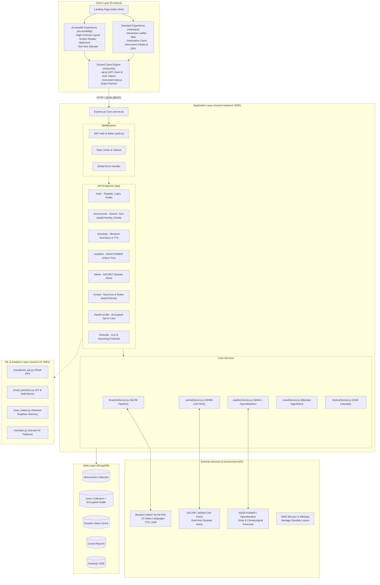
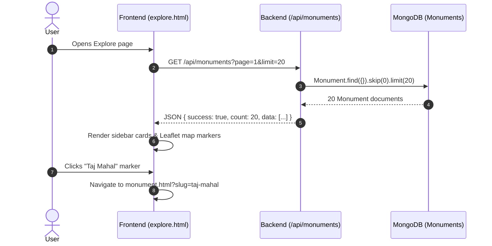
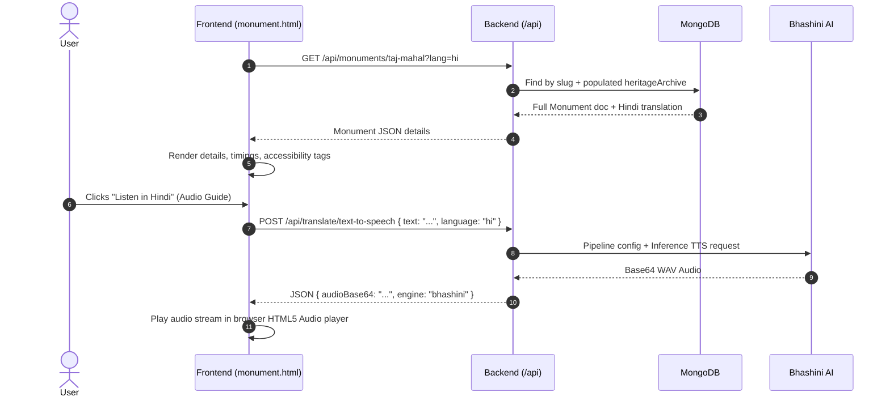
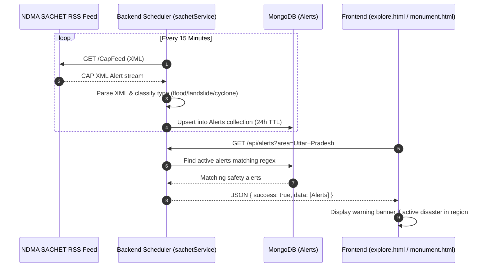

# 01. System Architecture and Data Flow

This document provides the foundational blueprint of **YatraMitra AI (Vistaara)**. It outlines how the client-side user interfaces, the Node.js/Express backend server, the MongoDB database, external government/weather APIs, and Python machine learning services communicate with each other.

---

## 1. High-Level Architecture Diagram

---

## 2. Architectural Layers Breakdown

### Layer 1: Presentation Layer (`frontend/`)
The frontend is designed with a **universal accessibility-first** model:
- **Landing Selector (`/index.html`)**: Allows the user to choose between the **Standard Visual Experience** and the **Accessible High-Contrast Experience**.
- **Standard UI (`/standard/`)**:
  - `index.html`: Hero banner, feature overview, underexplored destinations showcase.
  - `explore.html`: Two-pane layout with responsive sidebar list and full-screen **Leaflet.js** map showing monument pins.
  - `monument.html`: Monument deep dive with history, visiting hours, entry fees, audio narration trigger, and dynamic Q&A assistant.
- **Accessible UI (`/accessibility/`)**:
  - Semantic HTML5, high-contrast palette, dynamic font resizing (`100%`, `112%`, `128%` via `localStorage`), screen-reader focus handling, and step-free layout.
- **Shared Data Access (`/shared/js/`)**:
  - `api.js`: Centralized REST API client (Fetch wrapper with base URL, token injection, and error formatting).
  - `monument-data.js`: Helper functions providing data to both visual modes.

---

### Layer 2: API Gateway & Business Logic (`tourism-backend/`)
Built with **Node.js, Express, and Mongoose**:
- **Security & Reliability**: `helmet` (header protection), `cors` (origin whitelist), `express-rate-limit` (anti-abuse throttling), `compression` (gzip payloads).
- **Authentication & Authorization**: Stateless JWT token authentication (`auth.js`), role-based access (`admin`, `data_curator`, `user`), and AES-256 encrypted fields for sensitive personal health preferences.
- **Background Cron / Polling**:
  - Every 15 minutes, `sachetService.refreshAlerts()` polls India's NDMA SACHET CAP RSS feed, parsing disaster alerts and caching them into MongoDB for sub-10ms response times to client queries.

---

### Layer 3: Database Storage (`MongoDB`)
- **`Monument`**: Curated merged dataset (ASI, Bhuvan, Wikidata, Indian Culture Portal) with 2dsphere geo-indexing, multi-language translations (`hi`, `ta`, `te`, `bn`, etc.), accessibility tags, entry fees, and oral heritage audio archives.
- **`User`**: User credentials (bcrypt hashed passwords), language preference, and AES-encrypted opt-in health/mobility profile.
- **`Alert`**: Active disaster alerts (cyclone, flood, landslide, forest fire) with expiration TTL.
- **`CrowdReport`**: User crowd submissions and e-ticketing counts blended together for real-time congestion scores.
- **`Festival`**: Curated 2026 Indian festival calendar powering seasonal crowd surge multipliers.

---

### Layer 4: AI & ML Subsystems (`tourism-ml/`)
Python modules providing standalone AI logic or microservices:
1. **Underexplored API (`unexplored_api.py`)**: Flask microservice on port 5001 exposing `/api/unexplored` for promoting offbeat cultural gems.
2. **Multi-Factor Crowd Predictor (`crowd_predictor.py`)**: Predicts crowd density (1-10 scale) using day-of-week, hour-of-day, holiday status, weather conditions, and image feature heuristics.
3. **Route Optimizer (`route_maker.py`)**: Solves the Travelling Salesperson Problem (TSP) using a Nearest-Neighbor Haversine distance heuristic to generate optimized multi-monument itineraries.
4. **Sarvam AI Translator (`translate.py`)**: Multilingual translation for 10 Indian and 10 foreign languages.

---

## 3. End-to-End Request Data Flows

### A. Monument Discovery Flow

---

### B. Live Monument Details & Multilingual Voice Flow

---

### C. Safety & Disaster Alert Flow

