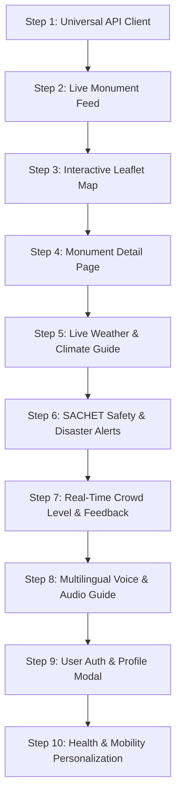

# 04. Step-by-Step Integration Roadmap

This document outlines the step-by-step roadmap for connecting your **Frontend** with the **Backend** and **ML Subsystems**. It breaks down each functionality into clear, non-breaking stages.

---

## 🧭 Integration Strategy Overview

To ensure zero regressions and smooth testing, integration is broken down into **10 Sequential Steps**:

---

## 🛠️ Step-by-Step Execution Plan

### Step 1: Create Centralized API Client (`frontend/shared/js/api.js`)
- **Objective**: Create a robust, reusable JavaScript utility that wraps native `fetch()` calls.
- **Key Responsibilities**:
  1. Configures `API_BASE_URL` (default: `http://localhost:5000/api`).
  2. Automatically attaches JWT authorization headers (`Bearer <token>`) from `localStorage`.
  3. Handles standard JSON serialization, error catches, and network offline status.
- **Deliverables**: A single `api.js` file included in all HTML pages before page-specific scripts.

---

### Step 2: Connect Featured Destinations Grid (`index.html` & `explore.html`)
- **Objective**: Switch from the static `shared/data/monuments.json` file to dynamic database queries via `/api/monuments`.
- **Changes in `standard.js` & `accessibility.js`**:
  1. Update `renderDestinationGrid()` to call `api.getMonuments({ underexplored: true, limit: 6 })`.
  2. Map backend fields (`m.name`, `m.state`, `m.shortDescription`, `m.slug`) into the card template.
  3. Update link targets to use slug parameter: `monument.html?slug=${m.slug}`.

---

### Step 3: Upgrade Leaflet Map with Real GPS Coordinates (`explore.html`)
- **Objective**: Plot all 30+ verified monuments on OpenStreetMap dynamically.
- **Actions**:
  1. Fetch all monuments using `api.getMonuments({ limit: 100 })`.
  2. For each monument, extract coordinates: `[location.coordinates[1], location.coordinates[0]]` *(note: GeoJSON is [lng, lat], Leaflet is [lat, lng])*.
  3. Attach interactive popups showing the monument thumbnail, state, entry fees, and "View Details" button.
  4. Auto-fit map bounds to encompass all plotted points: `map.fitBounds(markersGroup.getBounds())`.

---

### Step 4: Full Monument Detail Dynamic View (`monument.html`)
- **Objective**: Render all rich historical, cultural, architectural, and fee details for the selected monument.
- **Actions**:
  1. Read URL query param: `const slug = new URLSearchParams(window.location.search).get("slug");`.
  2. Fetch full record: `api.getMonument(slug, currentLanguage)`.
  3. Populate DOM elements:
     - Hero header, title, state/region, and photo gallery.
     - History & Cultural Significance sections.
     - Timings, entry fees (Indian & Foreigner), and Dos & Don'ts list.
     - Accessibility tags (e.g. *Wheelchair Accessible*, *Braille Signage*, *Electric Carts*).

---

### Step 5: Weather & "Best Time to Visit" Widget
- **Objective**: Display real-time climate signals and seasonal advice on the monument page.
- **Actions**:
  1. Call `api.getWeather(lat, lng)` and `api.getBestTimeAdvice(lat, lng, monument.timings.bestVisitMonths)`.
  2. Render a weather status chip in the sidebar/body showing:
     - Current average temperature (°C) and precipitation.
     - Seasonal verdict chip: *"Recommended Season"* (Green) or *"Off-Season Advice"* (Amber).

---

### Step 6: SACHET Disaster Alerts Banner
- **Objective**: Alert tourists in real-time about flood, landslide, or cyclone risks affecting the region.
- **Actions**:
  1. Call `api.getAlerts({ area: monument.state })`.
  2. If active alerts exist, render a prominent, high-contrast warning banner at the top of `monument.html` and `explore.html`.
  3. Show the official NDMA headline, emergency severity, and evacuation advice.

---

### Step 7: Live Crowd Level & Community Reporting
- **Objective**: Show real-time congestion levels and let travelers submit one-click crowd ratings.
- **Actions**:
  1. Call `api.getCrowdEstimate(slug)` to receive: `{ level: "low"|"moderate"|"high"|"very_high", confidence: "high" }`.
  2. Display a color-coded traffic badge:
     - 🟢 **Low** — Quiet & peaceful time to visit.
     - 🟡 **Moderate** — Average visitor density.
     - 🟠 **High** — Heavy crowds expected.
     - 🔴 **Very High** — Peak capacity, long queues.
  3. Include a 4-button quick report widget: *"How busy is it right now?"* that posts user reports to `/api/crowd/:slug/report`.

---

### Step 8: Multilingual Voice Narration & Bhashini TTS
- **Objective**: Enable visitors to listen to oral heritage accounts in 22 scheduled Indian languages.
- **Actions**:
  1. Provide a language dropdown (Hindi, Tamil, Telugu, Bengali, Marathi, English, etc.).
  2. Add an **"🎧 Listen to Audio Guide"** button next to the history text.
  3. When clicked, call `api.textToSpeech({ text, language })` to receive base64 audio.
  4. Play the audio directly in the browser using `new Audio('data:audio/wav;base64,' + data.audioBase64).play()`.

---

### Step 9: User Authentication & Profile
- **Objective**: Allow users to register, log in, set language preferences, and save bookmarks.
- **Actions**:
  1. Add a Login/Register modal button in the top navigation header.
  2. Store JWT token securely in `localStorage.setItem('yatramitra_token', token)`.
  3. Update UI header to display user name and language preferences when logged in.

---

### Step 10: Health Profile & Mobility Personalization
- **Objective**: Provide strictly opt-in, encrypted health and mobility filters (e.g. wheelchair access, asthma heat warnings, allergy food filters).
- **Actions**:
  1. Provide a "Personalize My Experience" settings panel.
  2. Send user choices to `PUT /api/health-profile`.
  3. Use `GET /api/health-profile/recommendation-flags` to automatically filter or highlight accessible monument routes and nearby cuisine suggestions.
